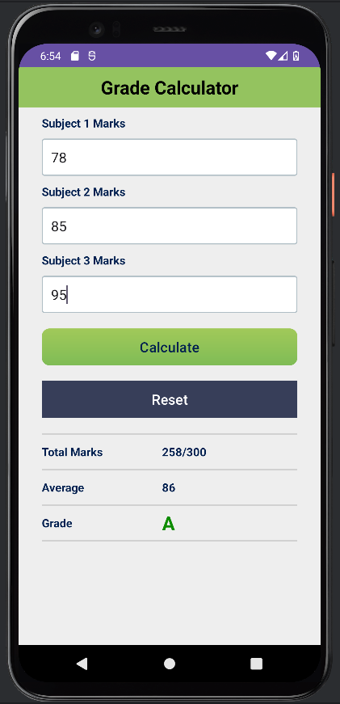

# 🎓 Grade Calculator (Android • Kotlin)

A clean, one‑screen **Grade Calculator** app built as a **Week‑1 Kotlin/Android learning project**.  
Enter marks for **3 subjects (0–100)** and instantly get **Total (out of 300)**, **Average**, and **Letter Grade (A–F)**.

<p align="left">
  
  
  
  
</p>

---

## ✨ What it does
- Accepts marks for **Subject 1, Subject 2, Subject 3**
- Enforces **0–100** input range (no decimals)
- Computes:
  - **Total** (e.g., `240/300`)
  - **Average**
  - **Grade** (A, B, C, D, F)
- Includes **Reset** to clear fields and restore defaults

---

## ✅ Features
- **Input validation** with `InputFilter` (blocks invalid typing like `101` or `999`)
- **Friendly feedback** via Toast messages (with a simple throttle to avoid spam)
- **Dynamic UI updates** (text + color changes based on grade)
- **Polished UI**: custom bordered inputs + styled buttons + tidy results section

---

## 🧠 What I learned
- Activity lifecycle basics (`onCreate`)
- Wiring UI with `findViewById`
- Handling clicks using `setOnClickListener`
- Restricting user input using **InputFilter**
- Updating UI state (`TextView.text`, `setTextColor`)
- Debugging common Android pitfalls (e.g., `setText(Int)` vs `setText(String)`)

---

## 🛠 Tech Stack
- **Kotlin**
- **Android Views + XML layouts**
- `EditText`, `TextView`, `Button`
- `InputFilter` for input restriction
- `ContextCompat` for runtime colors

---

## 📸 Screenshots




---

## ▶️ Run Locally
1. Clone:
```bash
git clone https://github.com/Md-Asifullah/grade-calculator.git
```
2. Open in **Android Studio**
3. Let **Gradle sync** finish
4. Run on an emulator or a real device
